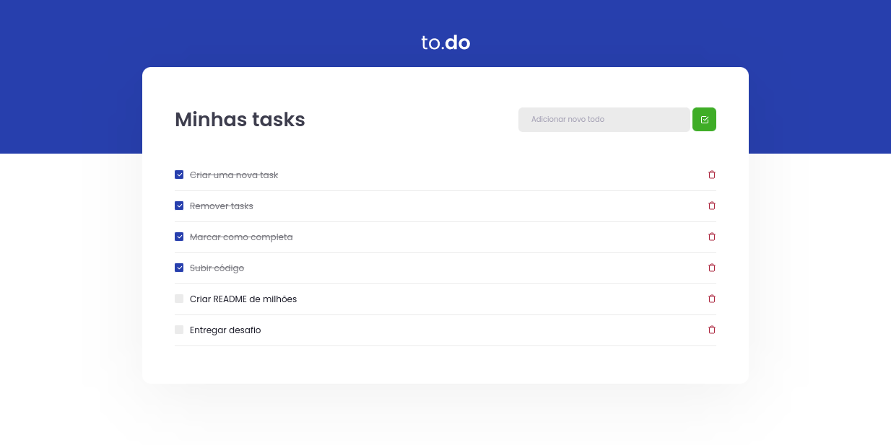

<h2 align="center">
   to.do | 
</h2>

<p align="center">
  
  
  
</p>

---

## 💻 Apresentação

**to.do** Essa será uma aplicação onde o seu principal objetivo é uma pequena aplicação de atividades a fazer, para treinar um pouco mais sobre manipulação do estado no React.

- Adicionar uma nova tarefa
- Remover uma tarefa
- Marcar e desmarcar uma tarefa como concluída


## 🧭 Como rodar o projeto

**Instale as dependências**

```bash
npm install
```

**Execute a aplicação**

```bash
npm run dev
```
*O projeto irá executar em **http://localhost:8080/***

## 🧪 Como rodar os testes

**Para executar os testes**

```bash
npm run test
```


## 🚀 Tecnologias

Esse projeto foi desenvolvido com as seguintes tecnologias:

- [ReactJS](https://pt-br.reactjs.org/)
- [React Testing Library](https://testing-library.com/docs/react-testing-library/intro/)
- [TypeScript](https://www.typescriptlang.org/pt/)
- [Webpack](https://webpack.js.org/)

## 📝 Licença

Esse projeto está sob a licença MIT. Veja o arquivo [LICENSE](LICENSE) para mais detalhes.
